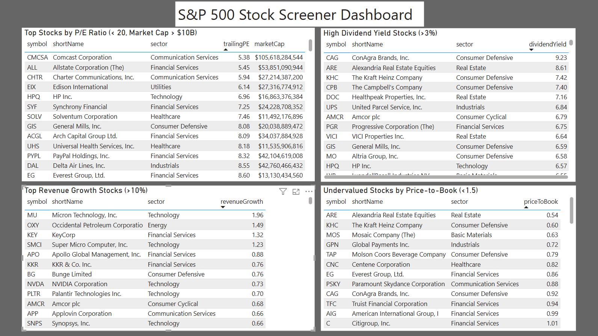

# S&P 500 Stock Screener

An end-to-end stock screening pipeline built with Python, SQLite, and Power BI. 
Pulls live financial data for all 503 S&P 500 companies using yfinance, stores 
it in a structured SQL database, and visualises the results in an interactive dashboard.

## Dashboard Preview



📊 Download `stock-screener-dashboard.pbix` and open in Power BI Desktop to explore the interactive dashboard.

## Project Structure
```
stock-screener/
├── data/
│   └── sp500.csv                     # S&P 500 constituent list
├── README.md
├── dashboard.png                     # Power BI dashboard screenshot
├── requirements.txt                  # Python dependencies
├── stock-screener-dashboard.pbix     # Power BI dashboard file
└── stock-screener.ipynb              # Main notebook
```

## How It Works

**Step 1: Python Stock Screener**  
Fetches financial data for all S&P 500 stocks using yfinance and enriches it with custom metrics including market cap category, 52-week price position, and company officer statistics. The enriched dataset is saved as a CSV.

**Step 2: SQL Layer**  
Writes the screener data into a local SQLite database and runs four targeted queries to surface stocks matching different investment strategies.

| Query | Strategy | Criteria |
|-------|----------|----------|
| 1 | Value | P/E < 20, Market Cap > $10B |
| 2 | Income | Dividend Yield > 3% |
| 3 | Growth | Revenue Growth > 10% |
| 4 | Deep Value | Price-to-Book < 1.5 |

**Step 3: Power BI Dashboard**  
Connects Power BI to the SQLite database via an ODBC driver and visualises all four screeners in a single-page interactive dashboard.

## Setup & Usage

### Prerequisites
- Python 3.x
- Power BI Desktop (Windows only)
- SQLite ODBC Driver

### Installation

1. Clone the repository:
```
   git clone https://github.com/veralaiys/stock-screener.git
```

2. Install dependencies:
```
   pip install -r requirements.txt
```

3. Download the S&P 500 CSV from [here](https://raw.githubusercontent.com/datasets/s-and-p-500-companies/main/data/constituents.csv) and save it as `data/sp500.csv`

4. Run all cells in `stock-screener.ipynb`

> ⚠️ The full data fetch in Step 1 takes several minutes as it pulls data for all 503 stocks one by one.

### Viewing the Dashboard

1. Install the SQLite ODBC Driver
2. Open ODBC Data Sources (64-bit) on Windows and register `data/stocks.db` as a System DSN named `StocksDB`
3. Open `stock-screener-dashboard.pbix` in Power BI Desktop

## Tech Stack

| Layer | Tools |
|-------|-------|
| Data Fetching | Python, yfinance, pandas |
| Data Storage | SQLite, sqlite3 |
| Data Processing | numpy, pandas |
| Visualisation | Power BI Desktop |

## Data Sources
- S&P 500 constituent list: [datasets/s-and-p-500-companies](https://github.com/datasets/s-and-p-500-companies)
- Financial data: [Yahoo Finance](https://finance.yahoo.com) via yfinance
